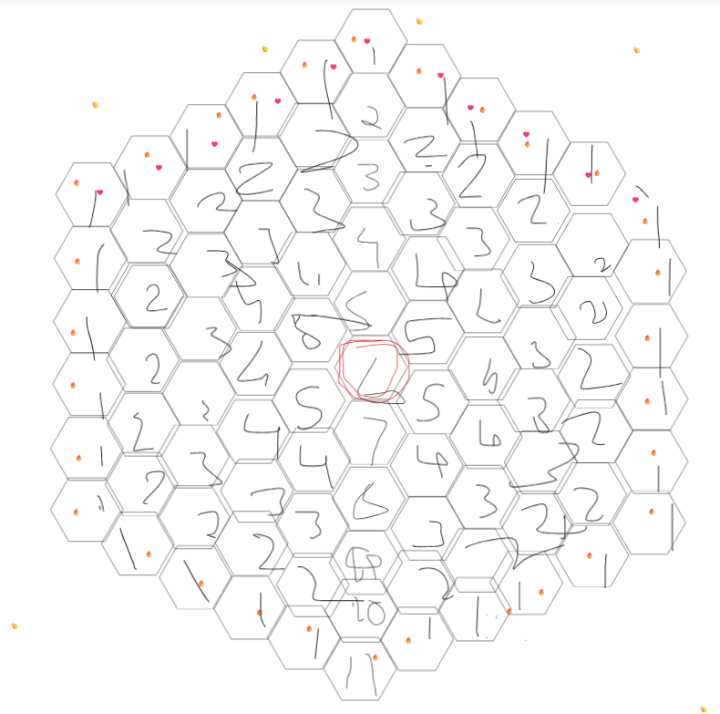

# Project-Hexagonal-Chess

The purpose of this project is to build a hexagonal chess game following Glinksi's variant. 
Planned tech stack for this project is: 
- TS
- HTML and CSS
- React framework 

Diagram for how board is built 
